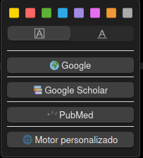

# Zotero Paper Search

[](https://www.zotero.org)
[](https://github.com/windingwind/zotero-plugin-template)
[](https://github.com//MiguelDLM/zotero-paper-search/blob/main/LICENSE)
[](https://github.com/MiguelDLM/zotero-paper-search/releases)

A Zotero plugin that provides quick access to multiple academic and web search engines directly from the PDF reader, with support for custom search engines and bilingual UI (English/Spanish).

## Features



- **Multiple Search Engines**: Instantly search selected text in 9 popular databases and web engines:
  - 🌍 **Google** – General web search
  - 📚 **Google Scholar** – Academic papers and citations
  - 🩺 **PubMed** – Biomedical and life science literature
  - 🔬 **arXiv** – Preprints in physics, mathematics, computer science
  - 🧠 **Semantic Scholar** – AI-powered scientific literature search
  - 🔬 **ResearchGate** – Scientific network and publications
  - 📖 **JSTOR** – Academic journals and books
  - ⚡ **IEEE Xplore** – Engineering and technology literature
  - 📚 **SpringerLink** – Scientific, technical and medical content
  - 🦕 **Where is My Fossil?** – Search for species in Where is My Fossil?
- **Custom Search Engine**: Enter any URL prefix (e.g. `https://mysearch.com/`) in the preferences. When you select a DOI, a button will appear to search using your custom engine (e.g. `https://mysearch.com/10.1234/abcd`).
- **Smart DOI Detection**: The custom search button only appears when a DOI is detected in the selected text.
- **User-Configurable**: Enable/disable each search engine in the preferences panel.
- **Modern UI**: Search engine buttons are shown in a compact, responsive grid (2 per row) for better usability.
- **Instant Search**: Select text in any PDF and search across your chosen engines with a single click.
- **Multi-language Support**: English and Spanish localizations. UI language matches your Zotero language.

## Installation

1. Download the latest XPI file from the [Releases](../../releases) page
2. In Zotero, go to Tools → Add-ons
3. Click the gear icon and select "Install Add-on From File"
4. Select the downloaded XPI file

## Usage

1. Open any PDF in Zotero's PDF reader
2. Select any text in the PDF
3. A popup menu will appear with buttons for your enabled search engines
4. Click any button to search the selected text in that database or web engine
5. If you select a DOI and have set a custom search prefix, a special button will appear to launch your custom search

## Configuration

- Go to **Zotero → Settings → Paper Search**
- In the "Search Engines" section, check/uncheck the engines you want
- To add a custom search engine, enter its URL prefix (e.g. `https://mysearch.com/`) in the provided field
- Changes take effect immediately

**Default enabled engines**: Google Scholar, PubMed, arXiv, Semantic Scholar

## Development

This plugin was built using the [Zotero Plugin Template](https://github.com/windingwind/zotero-plugin-template).

To set up for development:

1. Clone this repository
2. Copy `.env.example` to `.env` and configure paths
3. Run `npm install`
4. Run `npm start` for development with hot reload

### Building

```bash
npm run build        # Build for production
npm run lint:check   # Check code formatting
npm run lint:fix     # Fix code formatting
```

## License

This project is licensed under the AGPL-3.0-or-later license.
